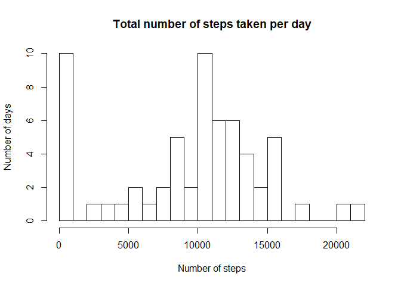
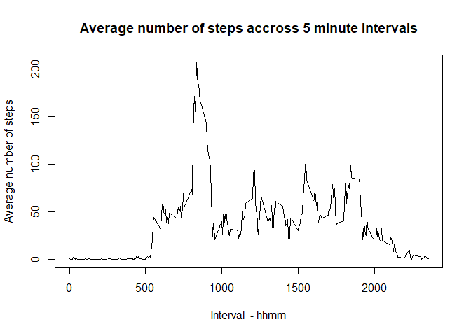
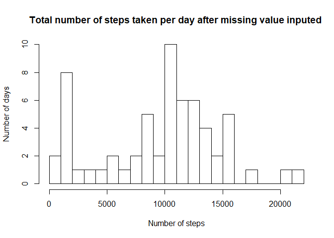
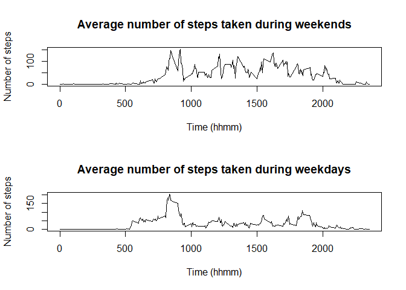
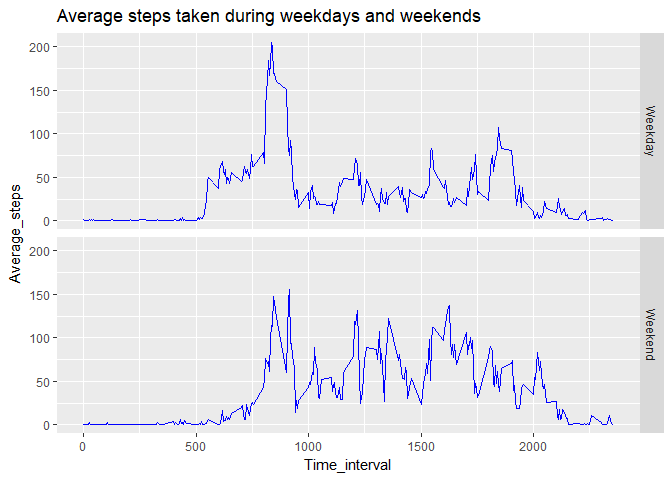

# Reproducible Research: Peer Assessment 1
Martin Slíva  
2018-02-28  


## Loading and preprocessing the data


```r
unzip(zipfile = "activity.zip") 
activity<-read.csv("activity.csv") 
```

Preprocessing of data is not applied.


## What is mean total number of steps taken per day?


```r
steps_sum<-with(activity, tapply(steps, date, FUN = sum, na.rm=T)) ### sum steps made every day

hist(steps_sum, breaks = 20, main="Total number of steps taken per day", xlab = "Number of steps", ylab = "Number of days" )
```

<!-- -->


```r
steps_mean<- mean(steps_sum)

steps_median<- median(steps_sum)
```

The mean of steps per day is 9354.2295082 and median is 10395.


## What is the average daily activity pattern?


```r
steps_interval<-with(activity, aggregate(steps, list(interval),FUN=mean, na.rm=T )) ### 
names(steps_interval)<-c("Interval","Steps")
plot(steps_interval$Interval,steps_interval$Steps, type = "l", xlab = "Interval  - hhmm", ylab = "Average number of steps", main = "Average number of steps accross 5 minute intervals")
```

<!-- -->

```r
steps_interval_max<-steps_interval$Interval[which.max(steps_interval$Steps)]
```
Maximal steps are in interval 835.


## Imputing missing values


```r
number_na<-sum(is.na(activity))
```

Number of missing values is 2304.


```r
steps_interval_median<-with(activity, tapply(steps, interval,FUN=median, na.rm=T ))     ### calculation of median for all interval - NA excluded
steps_na<-which(is.na(activity$steps))                                                  ### finding which rows have NA in steps column
activity_new<-activity                                                                  ### creating new variable
for(i in steps_na) {activity_new$steps[i]<-steps_interval_median[[1+activity$interval[i]%/%100*12+activity$interval[i]%%100/5]]}  ### replacement the NA by calculated median
```


```r
steps_sum_new<-with(activity_new, tapply(steps, date, FUN = sum, na.rm=T))          ### Calculation sums of steps per date  

hist(steps_sum_new, breaks = 20, main="Total number of steps taken per day after missing value inputed ", xlab = "Number of steps", ylab = "Number of days" )
```

<!-- -->


```r
 steps_mean_new<-mean(steps_sum_new)
```


```r
 steps_median_new<-median(steps_sum_new)
```
After filling missing value by median of time interval new mean is 9503.8688525 and new median is 10395.


## Are there differences in activity patterns between weekdays and weekends?


```r
activity_new$weekend<-(weekdays(as.Date(activity_new$date)) ==weekdays(as.Date("2018-02-25")) | weekdays(as.Date(activity_new$date)) ==weekdays(as.Date("2018-02-24")))              ### creating variable for division between weekdays and weekends, particular dates for Sunday and Saturday are taken to avoid problems with Locales

steps_interval_new<-with(activity_new, aggregate(steps, by=list(interval,weekend),FUN=mean))

steps_interval_new$day_type[steps_interval_new$Group.2]<-"Weekend"
steps_interval_new$day_type[!steps_interval_new$Group.2]<-"Weekday"
names(steps_interval_new)[1:3]<-c("Time_interval", "Weekend", "Average_steps")
```


```r
par(mfrow=c(2,1))
plot(steps_interval_new[steps_interval_new[,2],1], steps_interval_new[steps_interval_new[,2],3], type = "l", main="Average number of steps taken during weekends", xlab = "Time (hhmm)", ylab = "Number of steps")
plot(steps_interval_new[!steps_interval_new[,2],1], steps_interval_new[!steps_interval_new[,2],3], type = "l", main="Average number of steps taken during weekdays", xlab = "Time (hhmm)", ylab = "Number of steps")
```

<!-- -->


```r
library(ggplot2)

final_chart <- ggplot(steps_interval_new, aes(x=Time_interval, y=Average_steps))+geom_line(colour="blue")+facet_grid(day_type~.)+ggtitle("Average steps taken during weekdays and weekends")

final_chart
```

<!-- -->

